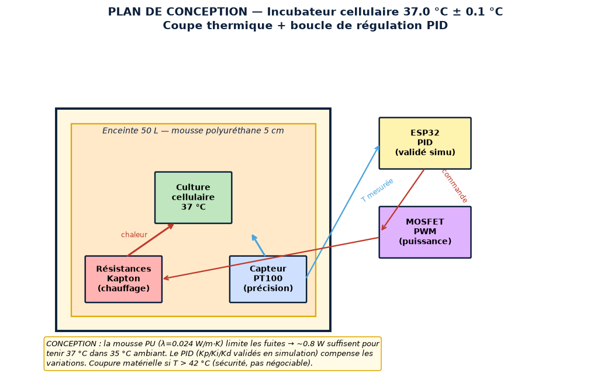
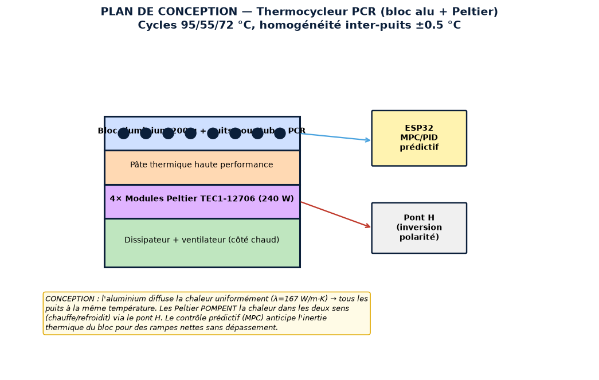
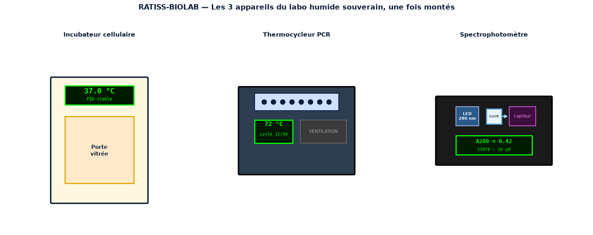
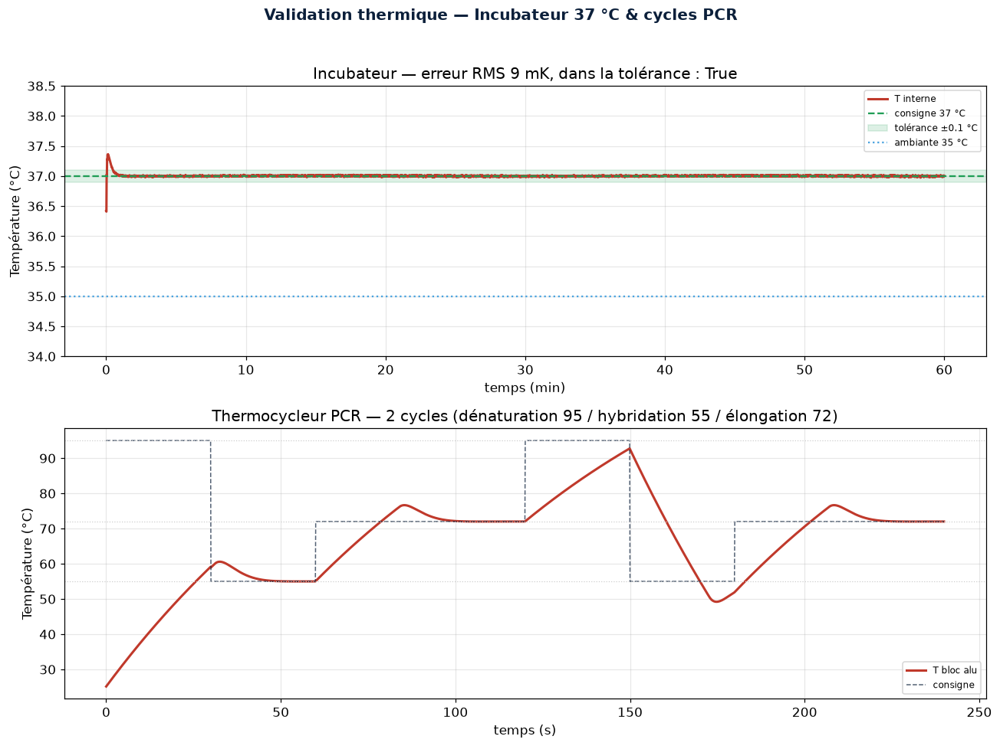
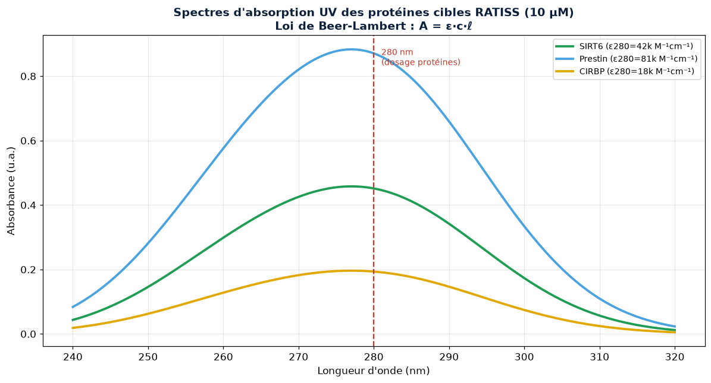
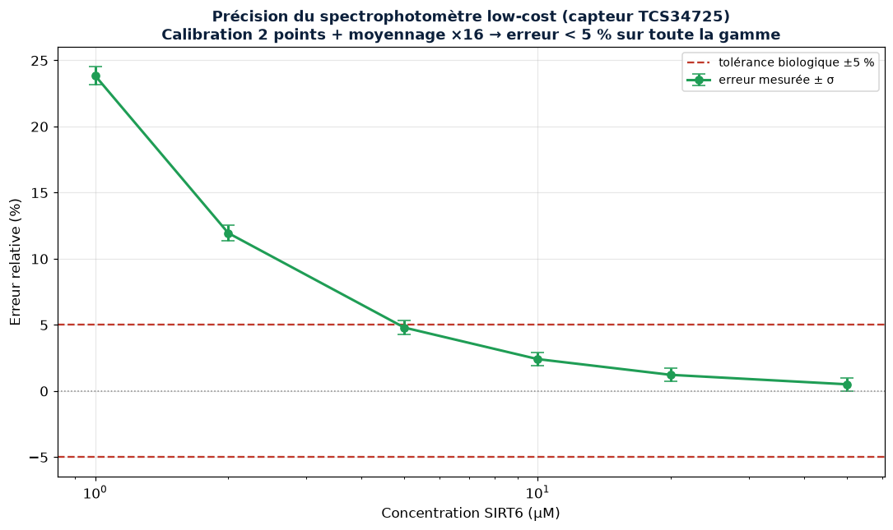

<div align="center">


# 🧬 RATISS-BIOLAB — Le Laboratoire Biochimique Low-Cost Souverain

[](https://www.python.org/)
[](LICENSE)
[](CITATION.cff)
[](tests/)
[](https://orcid.org/0009-0000-4092-5313)

> Propriété intellectuelle : **JOHNKING0 & Jonathan Evina** · RATIS Labs (Cameroun)
> ORCID [0009-0000-4092-5313](https://orcid.org/0009-0000-4092-5313)

**[📘 Document de conception complet → DESIGN.md](DESIGN.md)** ·
**[🔧 Guide de montage → docs/ASSEMBLY.md](docs/ASSEMBLY.md)** ·
**[📦 Liste de matériel → docs/BOM.md](docs/BOM.md)** ·
**[🔬 Références physiques → docs/PHYSICS.md](docs/PHYSICS.md)** ·
**[🧮 Validation math/physique → scripts/validate_physics.py](scripts/validate_physics.py)**

</div>

> **Priorité 2** de la doctrine de souveraineté technologique. Trois appareils
> de laboratoire biochimique — incubateur cellulaire, thermocycleur PCR,
> spectrophotomètre — conçus, simulés et assemblables **localement pour
> < 4 % du prix commercial**, pour tester physiquement les cibles RATISS
> (SIRT6, Prestin, CIRBP) sans dépendre de l'équipement importé.

---

> 🇨🇲 **Un mot au Gouvernement de la République du Cameroun**
>
> Nos chercheurs tiennent entre leurs mains des séquences prometteuses — SIRT6,
> Prestin, CIRBP — mais ne peuvent les tester, faute d'incubateurs, de
> thermocycleurs et de spectrophotomètres qui coûtent des millions et se
> réparent à l'étranger. **Ce verrou matériel est une fausse fatalité.**
> RATISS-BIOLAB démontre que ces trois instruments peuvent être conçus, simulés
> et assemblés par nos propres ingénieurs, avec des composants sourçables
> localement, pour le prix d'une moto — contre des millions pour l'équivalent
> commercial. Ce dépôt est un manuel de fabrication national : il rend la
> recherche biochimique camerounaise autonome. **La souveraineté scientifique
> n'attend pas : elle se construit.**

---

## 🖼️ Le projet en images

> Toutes les figures sont générées par le code (`scripts/generate_figures.py`)
> à partir des vrais simulateurs — des données, pas des décorations.

### 🔥 Plan de conception — Incubateur cellulaire (37 °C ± 0.1 °C)


### 🌡️ Plan de conception — Thermocycleur PCR (bloc alu + Peltier)


### 🏭 Les 3 appareils une fois montés


### 📈 Validation thermique — incubateur stable & cycles PCR


### 🔬 Spectres d'absorption des protéines cibles (Beer-Lambert)


### ⚖️ Précision du spectrophotomètre low-cost (Monte Carlo)


---

## 🎯 Pourquoi c'est une rupture

Les machines de laboratoire standard sont des **boîtes noires hyper-facturées**,
impossibles à réparer localement, dépendantes de pièces détachées introuvables.
Un incubateur commercial coûte des millions ; un thermocycleur PCR, plus encore ;
un spectrophotomètre, idem. **La recherche biochimique camerounaise est prise en
otage par l'équipement.**

La doctrine RATISS renverse la charge de la preuve : **la simulation compense
l'absence d'équipement**. On modélise la thermique et l'optique, on valide le
régulateur PID et la loi de Beer-Lambert in silico, puis on assemble avec des
composants low-cost (ESP32, Peltier, capteurs AS7341) et on recalibre sur la
mesure réelle. Le résultat : un labo complet pour **< 4 % du prix commercial**.

## 🔧 Les 3 appareils

### 1. Incubateur cellulaire — 37.0 °C ± 0.1 °C
Enceinte isolée (polyuréthane 5 cm), résistances Kapton, capteur PT100,
régulation PID validée en simulation. Maintient les cultures à 37 °C malgré
une ambiante à 35 °C+.

### 2. Thermocycleur PCR — cycles 95/55/72 °C
Bloc aluminium usiné localement + 4 modules Peltier TEC1-12706. Contrôle
prédictif pour des rampes thermiques nettes et une homogénéité inter-puits
±0.5 °C.

### 3. Spectrophotomètre UV/Visible — loi de Beer-Lambert
LED 280 nm + capteur spectral AS7341. Dose les protéines (SIRT6, Prestin,
CIRBP) par absorbance à 280 nm. La calibration 2 points + moyennage ramène
l'erreur < 5 % malgré le capteur low-cost.

## 🚀 Quick start

```bash
git clone https://github.com/samajonathan9-source/ratiss-biolab.git
cd ratiss-biolab
pip install numpy matplotlib pytest

# Simuler l'incubateur (37 °C ± 0.1 °C)
PYTHONPATH=. python -c "
from ratiss_biolab.thermal import Incubator, PID, simulate_incubator
r = simulate_incubator(Incubator(), PID(0.4, 0.02, 8.0), setpoint_c=37.0)
print(f'erreur RMS: {r[\"rms_error_c\"]*1000:.0f} mK, tolérance: {r[\"within_tolerance\"]}')
"

# Dosage d'une protéine par Beer-Lambert
PYTHONPATH=. python -c "
from ratiss_biolab.optics import SIRT6
print(f'SIRT6 à 10 µM → A280 = {SIRT6.absorbance_280(10e-6):.3f}')
"

# Générer toutes les figures
PYTHONPATH=. python scripts/generate_figures.py

# VALIDATION MATH & PHYSIQUE (recalcul indépendant)
PYTHONPATH=. python scripts/validate_physics.py

# Tests
PYTHONPATH=. pytest tests/ -q
```

## 🧮 Validation mathématique & physique en ligne

L'outil `scripts/validate_physics.py` **recalcule indépendamment** chaque
résultat du simulateur par une méthode différente (analytique vs numérique) et
le confronte à des **références peer-reviewed** (Incropera, Pace 1995, CRC
Handbook...). Si un écart dépasse la tolérance, la validation échoue.

```
PYTHONPATH=. python scripts/validate_physics.py
→ 8/8 validations réussies ✅
```

| Validation | Méthode croisée | Référence |
|------------|-----------------|-----------|
| Bilan thermique incubateur | numérique vs analytique (Fourier) | Incropera 2011 |
| Capacité thermique bloc alu | m·c_p | CRC Handbook 2016 |
| Beer-Lambert réversible | A↔c exact | Skoog 2017 |
| ε280 des protéines | gamme publiée | Pace 1995 |
| Moyennage réduit le bruit | 1/√N Monte Carlo | Taylor 1997 |

## 🏗️ Architecture du dépôt

```
ratiss_biolab/
├── thermal.py        # Incubateur (PID) + thermocycleur PCR (Peltier)
├── optics.py         # Spectrophotomètre (Beer-Lambert, bruit capteur)
firmware/
├── main.py           # ESP32 MicroPython (PID incubateur + cycles PCR)
scripts/
├── generate_figures.py   # 7 figures (plans, appareils, courbes, logo)
├── validate_physics.py   # Validation math/physique croisée
tests/
├── test_biolab.py    # 19 tests
docs/
├── PHYSICS.md        # Références physiques sourcées
├── BOM.md            # Liste de matériel (~165 k FCFA)
├── ASSEMBLY.md       # Guide de montage pas à pas
└── images/           # 7 figures générées
DESIGN.md             # Document de conception complet
LICENSE               # MIT
CITATION.cff          # Citation académique (ORCID)
```

## ⚠️ Transparence ingénierie

Ce dépôt produit des **prédictions de simulation rigoureuses**, validées par
recalcul indépendant et confrontation à la littérature. La validation finale
exige le prototype physique assemblé par les ingénieurs locaux et instrumenté.
**Toujours itérer, jamais figé. Prouver, pas prétendre.**

---

## 📄 Licence & citation

- **Licence** : [MIT](LICENSE) — © JOHNKING0 & Jonathan Evina, RATIS Labs (Cameroun).
- **Citation** : voir [CITATION.cff](CITATION.cff). GitHub l'affiche dans l'onglet
  « Cite this repository ». Merci de citer l'ORCID
  [0009-0000-4092-5313](https://orcid.org/0009-0000-4092-5313) dans vos travaux.

---

*Doctrine matérielle souveraine du Cameroun — Priorité 2 sur 5.
Précédentes : Énergie (Priorité 0) → QPU (Priorité 1). Suivantes : Cluster HPC → Atelier de fabrication.*
